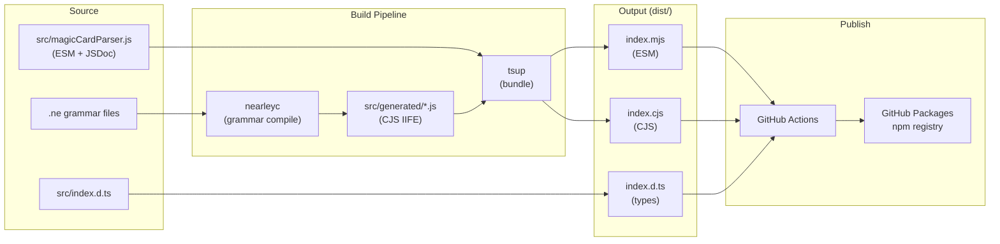

# Detailed Design: ESM Conversion & GitHub Packages Publishing

## Overview

Convert `magic-card-parser` from a CommonJS package published to npm into a dual-format (ESM + CJS) scoped package (`@oscarhermoso/magic-card-parser`) published to GitHub Packages via CI/CD. Add JSDoc type annotations to the source with TypeScript type-checking enabled.

## Detailed Requirements

1. **Package identity:** Rename to `@oscarhermoso/magic-card-parser@0.4.0`, update repository URL to `oscarhermoso/magic-card-parser`
2. **Module format:** Dual ESM (`.mjs`) and CJS (`.cjs`) output via tsup bundler
3. **Type system:** JSDoc annotations on JS source, type-checked by TypeScript (`checkJs: true`), existing `index.d.ts` maintained as published type declarations
4. **Build pipeline:** Nearley grammar compilation → tsup bundling (grammars bundled as local files, nearley externalized)
5. **Publishing:** GitHub Actions workflow triggered on GitHub release (`published` event), publishes to GitHub Packages npm registry
6. **Scripts:** Convert `scripts/*.js` utility files to ESM syntax
7. **Tests:** Existing Vitest tests continue to pass with updated import syntax
8. **README:** Add installation instructions for consumers using GitHub Packages (`.npmrc` setup, auth, install command)
9. **Validation:** Verify the conversion works end-to-end by updating the adjacent `mtg-cube-simulator` repo to use ESM imports from the rebuilt package, confirming `npm run dev` no longer errors with "require is not defined in ES module scope"

## Architecture Overview



## Components and Interfaces

### 1. Source Module (`src/magicCardParser.js`)

Convert from CommonJS to ESM syntax:

**Before:**
```javascript
const { Parser, Grammar } = require('nearley');
const magicCardGrammar = require('./generated/magicCardGrammar');
// ...
module.exports = { parseCard, parseTypeLine, cardToGraphViz };
```

**After:**
```javascript
import { Parser, Grammar } from 'nearley';
import magicCardGrammar from './generated/magicCardGrammar.js';
// ...
export { parseCard, parseTypeLine, cardToGraphViz };
```

Add JSDoc annotations referencing types from `index.d.ts`:
```javascript
/** @typedef {import('./index.d.ts').CardInput} CardInput */
/** @typedef {import('./index.d.ts').ParseResult} ParseResult */

/**
 * @param {CardInput} card
 * @returns {ParseResult}
 */
function parseCard(card) { ... }
```

### 2. tsup Configuration (`tsup.config.ts`)

```typescript
import { defineConfig } from 'tsup';

export default defineConfig({
  entry: ['src/magicCardParser.js'],
  format: ['esm', 'cjs'],
  outDir: 'dist',
  outExtension({ format }) {
    return { js: format === 'esm' ? '.mjs' : '.cjs' };
  },
  clean: true,
  splitting: false,
  sourcemap: true,
  // Bundle generated grammars (local files), externalize nearley (npm dep)
  noExternal: [],
  external: ['nearley'],
  banner({ format }) {
    // Shim require() in ESM for nearley compatibility
    if (format === 'esm') {
      return {
        js: "import {createRequire as __createRequire} from 'module';\nvar require=__createRequire(import.meta.url);",
      };
    }
    return {};
  },
});
```

**Key decisions:**
- Generated grammar files are local `require()` calls — tsup bundles them automatically
- `nearley` stays external — it's a runtime dependency consumers install
- `createRequire` banner shim ensures any remaining `require()` calls work in ESM output
- `dts` not used — we maintain `index.d.ts` manually and copy it to dist

### 3. Package.json Changes

```json
{
  "name": "@oscarhermoso/magic-card-parser",
  "version": "0.4.0",
  "type": "module",
  "main": "./dist/index.cjs",
  "module": "./dist/index.mjs",
  "types": "./dist/index.d.ts",
  "exports": {
    ".": {
      "types": "./dist/index.d.ts",
      "import": "./dist/index.mjs",
      "require": "./dist/index.cjs"
    }
  },
  "files": [
    "dist/**/*",
    "README.md"
  ],
  "publishConfig": {
    "registry": "https://npm.pkg.github.com/"
  },
  "repository": {
    "type": "git",
    "url": "https://github.com/oscarhermoso/magic-card-parser.git"
  },
  "homepage": "https://github.com/oscarhermoso/magic-card-parser",
  "scripts": {
    "build:grammar": "sh nearley/helper.sh",
    "build:bundle": "tsup",
    "build": "npm run build:grammar && npm run build:bundle",
    "typecheck": "tsc --noEmit",
    "test": "vitest run",
    "prepublishOnly": "npm run build"
  }
}
```

**Key decisions:**
- `"type": "module"` — project is ESM-first
- `exports` map with `types` first for correct TypeScript resolution
- `files` points to `dist/` instead of `src/`
- Build split into `build:grammar` (nearley) and `build:bundle` (tsup)
- `prepublishOnly` ensures build runs before publish

### 4. TypeScript Configuration Updates

```json
{
  "compilerOptions": {
    "target": "ES2020",
    "module": "ES2020",
    "moduleResolution": "bundler",
    "strict": true,
    "esModuleInterop": true,
    "skipLibCheck": true,
    "forceConsistentCasingInFileNames": true,
    "allowJs": true,
    "checkJs": true,
    "noEmit": true,
    "resolveJsonModule": true
  },
  "include": ["src/**/*.js", "src/**/*.ts", "src/**/*.d.ts", "__tests__/**/*.ts"],
  "exclude": ["node_modules", "src/generated", "dist"]
}
```

**Changes from current:**
- `module`: `commonjs` → `ES2020`
- `moduleResolution`: `node` → `bundler`
- `checkJs`: `false` → `true`
- Removed `declaration` and `declarationDir` (not emitting via tsc)
- Added `dist` to exclude
- Added `src/**/*.js` to include

### 5. GitHub Actions Workflow (`.github/workflows/publish.yml`)

```yaml
name: Publish Package

on:
  release:
    types: [published]

jobs:
  publish:
    runs-on: ubuntu-latest
    permissions:
      contents: read
      packages: write
    steps:
      - uses: actions/checkout@v4

      - uses: actions/setup-node@v4
        with:
          node-version: '20'
          registry-url: 'https://npm.pkg.github.com'
          scope: '@oscarhermoso'

      - run: npm ci
      - run: npm run build
      - run: npm test
      - run: npm publish
        env:
          NODE_AUTH_TOKEN: ${{ secrets.GITHUB_TOKEN }}
```

**Key decisions:**
- Uses built-in `GITHUB_TOKEN` — no extra secrets needed
- Runs tests before publishing as a safety gate
- `setup-node` with `registry-url` configures `.npmrc` automatically

### 6. Build Script Updates (`nearley/helper.sh`)

No changes needed — grammar compilation stays as-is. The generated CJS files are bundled by tsup.

### 7. Script Conversions (`scripts/*.js`)

Convert `require()` → `import`, `module.exports` → `export`. These scripts aren't published but need ESM syntax because `"type": "module"` in package.json.

### 8. Test Updates

Convert test imports from `require()` to `import`:
```typescript
// Before
const { parseCard, parseTypeLine } = require('../src/magicCardParser');

// After
import { parseCard, parseTypeLine } from '../src/magicCardParser.js';
```

### 9. dist/ Build Copy Step

The `index.d.ts` needs to be copied to `dist/` during the build. Add to the build:bundle script or use a small post-build copy step:

```json
"build:bundle": "tsup && cp src/index.d.ts dist/index.d.ts"
```

### 10. README Installation Section

Add a section to `README.md` documenting how consumers install from GitHub Packages:

```markdown
## Installation

This package is published to [GitHub Packages](https://github.com/oscarhermoso/magic-card-parser/packages).

### 1. Configure npm registry

Create or update `.npmrc` in your project root:

```
@oscarhermoso:registry=https://npm.pkg.github.com/
//npm.pkg.github.com/:_authToken=${GITHUB_TOKEN}
```

You'll need a [GitHub personal access token](https://github.com/settings/tokens) with `read:packages` scope, set as the `GITHUB_TOKEN` environment variable.

### 2. Install

```bash
npm install @oscarhermoso/magic-card-parser
```

### 3. Usage

```javascript
// ESM
import { parseCard, parseTypeLine } from '@oscarhermoso/magic-card-parser';

// CommonJS
const { parseCard, parseTypeLine } = require('@oscarhermoso/magic-card-parser');
```
```

### 11. Validation: mtg-cube-simulator Integration

The adjacent `mtg-cube-simulator` repo is the primary consumer and validation target.

**Current state:**
- `mtg-cube-simulator` has `"type": "module"` (ESM)
- `magic-card-parser` is symlinked from sibling directory
- `src/engine/CardParser.ts` uses `require('magic-card-parser')` which fails in ESM context

**Fix in mtg-cube-simulator:**
```typescript
// Before (broken)
const magicCardParser = require('magic-card-parser');
const mcpParseCard = magicCardParser.parseCard;
const mcpParseTypeLine = magicCardParser.parseTypeLine;

// After (working)
import { parseCard as mcpParseCard, parseTypeLine as mcpParseTypeLine } from 'magic-card-parser';
```

**Validation steps:**
1. Build `magic-card-parser` (`npm run build`) to produce `dist/` with ESM + CJS output
2. Update `mtg-cube-simulator/src/engine/CardParser.ts` to use ESM imports
3. Run `npm run dev` in `mtg-cube-simulator` — confirm no "require is not defined" error
4. Verify card parsing still works correctly at runtime

## Data Models

No changes to data models. All existing types in `index.d.ts` (CardInput, ParseResult, TypeLineResult, AST node types) remain unchanged.

## Error Handling

- **Build failures:** `prepublishOnly` prevents publishing if build fails
- **CI failures:** Tests run before `npm publish` in the workflow
- **Grammar compilation errors:** Caught by existing `nearleyc` error output
- **Type errors:** `checkJs: true` catches type mismatches between JSDoc annotations and implementation during `npm run typecheck`

## Testing Strategy

- **Existing tests:** All current Vitest tests must pass after conversion (import syntax updated)
- **Type checking:** `npm run typecheck` validates JSDoc annotations match `index.d.ts`
- **Package validation:** Use `@arethetypeswrong/cli` and `publint` to verify exports map and type resolution
- **CI gate:** Tests run in GitHub Actions before publish

## Appendices

### A. Technology Choices

| Choice | Selected | Alternatives Considered | Rationale |
|--------|----------|------------------------|-----------|
| Bundler | tsup | Rollup, esbuild, tsc | Zero-config dual output, handles CJS interop |
| Type system | JSDoc + checkJs | Convert to TypeScript | User preference; keeps source as JS |
| CI/CD | GitHub Actions | Manual publish | Automated, uses built-in GITHUB_TOKEN |
| Registry | GitHub Packages | npm registry | User requirement |
| Grammar bundling | tsup bundles generated files | Modify nearleyc output to ESM | Simpler — no changes to grammar build |

### B. Key Constraints

- Nearley has no native ESM support — requires `createRequire` shim or external dependency
- Generated grammar files are ~640KB each — bundling them increases output size but simplifies the consumer experience
- GitHub Packages requires authentication even for public packages

### C. Alternative Approaches Considered

1. **Bundle nearley into output** (`noExternal: ['nearley']`): Would remove nearley as a runtime dependency but increases bundle size. Kept external for now to match standard library practices.
2. **Use nearleyc `--export esmodule`**: Would generate ESM grammar files, but tsup handles CJS bundling fine so this adds complexity without benefit.
3. **Separate `.d.ts` generation via tsc**: Considered but unnecessary since `index.d.ts` is manually maintained and comprehensive.
